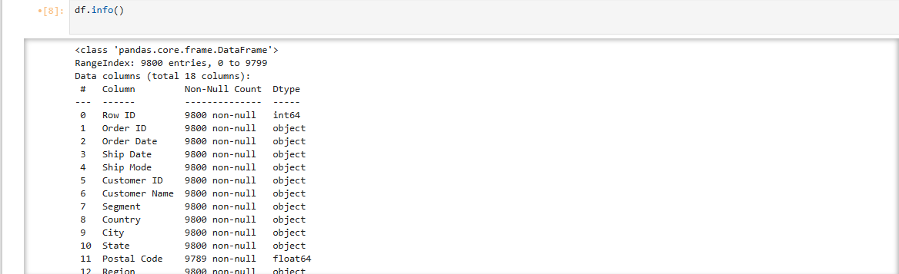
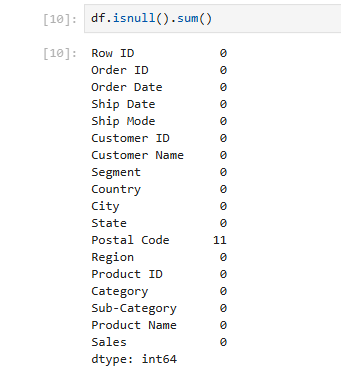
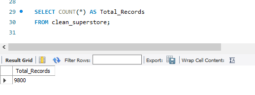
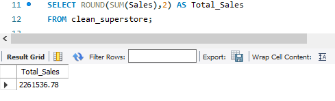
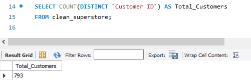
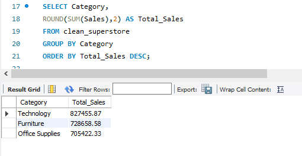
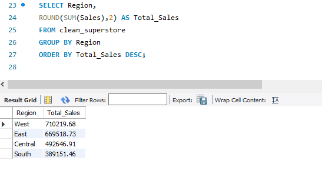

# 📊 Executive Sales Performance Dashboard using Python, MySQL & Power BI

## 📌 Project Overview

This project is an end-to-end Data Analytics project developed using Python, MySQL, and Power BI. The objective is to clean, analyze, validate, and visualize Superstore sales data to generate meaningful business insights for better business decision-making.

The project follows a complete analytics workflow:
- Data Cleaning using Python
- Data Analysis using MySQL
- Interactive Dashboard using Power BI

---

# 🎯 Objectives

- Clean and preprocess the Superstore dataset using Python.
- Perform business analysis using SQL.
- Build an interactive Power BI dashboard.
- Analyze sales across categories, regions, states, cities, products, and customer segments.
- Generate meaningful business insights.

---

# 🛠️ Tech Stack

| Technology | Purpose |
|------------|---------|
| Python | Data Cleaning & Analysis |
| Pandas | Data Manipulation |
| NumPy | Numerical Operations |
| Matplotlib | Data Visualization |
| MySQL | Data Analysis |
| Power BI | Dashboard Development |
| Jupyter Notebook | Python Development |

---

# 📂 Project Structure

```text
Executive-Sales-Performance-Dashboard/
│
├── dataset/
│   ├── og_superstore.csv
│   └── clean_superstore.csv
│
├── notebooks/
│   └── Superstore_Sales_Analysis.ipynb
│
├── powerbi/
│   └── Executive_Sales_Dashboard.pbix
│
├── sql/
│   └── sales_analysis.sql
│
├── report/
│   └── Executive_Sales_Performance_Dashboard.pdf
│
├── project_screenshots/
│   ├── PowerBI/
│   │   └── dashboard.png
│   │
│   ├── python/
│   │   ├── shape.png
│   │   ├── info.png
│   │   └── null.png
│   │
│   └── sql/
│       ├── total_records.png
│       ├── total_sales.png
│       ├── total_customers.png
│       ├── sales_by_category.png
│       └── sales_by_region.png
│
├── README.md
└── requirements.txt
```

---

# 🔄 Project Workflow

```text
Raw Superstore Dataset
        │
        ▼
Python Data Cleaning
        │
        ▼
Clean Dataset
        │
        ▼
MySQL Data Analysis
        │
        ▼
Power BI Dashboard
        │
        ▼
Business Insights
```

---

# 📊 Dashboard Preview
 


---

# 📈 Dashboard KPIs

- Total Sales
- Total Orders
- Total Customers
- Sales by Category
- Sales by Region
- Top 10 States
- Top 10 Cities
- Top 10 Products

---

# 🐍 Python Screenshots

## Dataset Shape


## Dataset Information



## Missing Value Analysis



---

# 🗄️ SQL Screenshots

## Total Records



## Total Sales



## Total Customers



## Sales by Category



## Sales by Region



---

# 📈 Key Insights

- Total Sales: **2.26 Million**
- Total Orders: **4,922**
- Total Customers: **793**
- Technology generated the highest sales.
- West region generated the highest revenue.
- California recorded the highest state-wise sales.
- New York City generated the highest city-wise sales.
- Canon imageCLASS 2200 Advanced Copier was the highest-selling product.

---

# 💡 Business Recommendations

- Increase investment in Technology products.
- Improve sales performance in the South region.
- Focus on high-performing products.
- Monitor monthly sales trends for better forecasting.
- Use dashboard insights for business decision-making.

---

# 📁 Project Files

| Folder | Description |
|---------|-------------|
| dataset | Raw and Clean Superstore Dataset |
| notebooks | Python Data Analysis Notebook |
| sql | SQL Analysis Queries |
| powerbi | Power BI Dashboard |
| report | Project Report |
| project_screenshots | Python, SQL and Power BI Screenshots |

---

# 🚀 Future Improvements

- Profit Analysis Dashboard
- Discount Analysis
- Customer Segmentation
- Sales Forecasting using Machine Learning
- Real-time Database Integration
- Interactive Drill-through Reports

---

# 👩‍💻 Author

**Neha Arun Sadar**

Aspiring Data Analyst

## Skills

- Python
- SQL
- Power BI
- Pandas
- NumPy
- Matplotlib
- Data Cleaning
- Data Visualization
- Business Intelligence

---

⭐ **If you found this project useful, please consider giving it a Star.**

 Markdown: Open Preview to the Side
